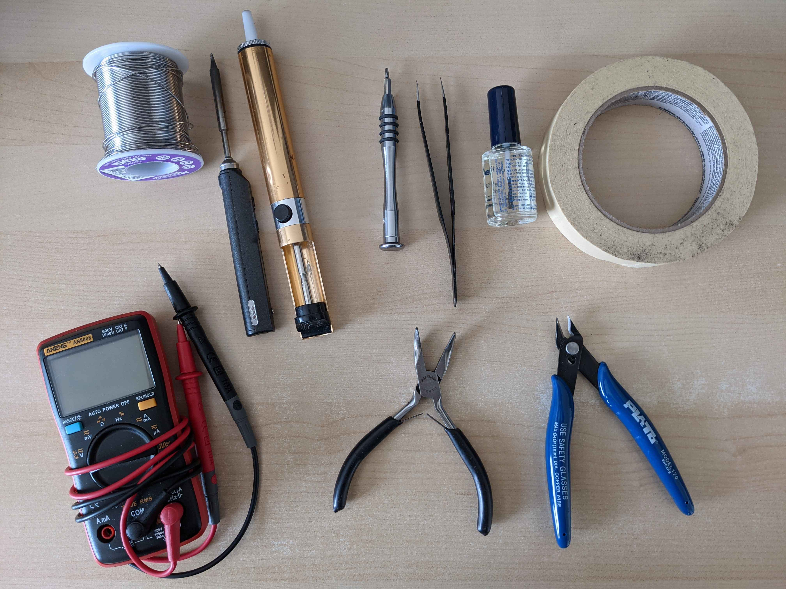
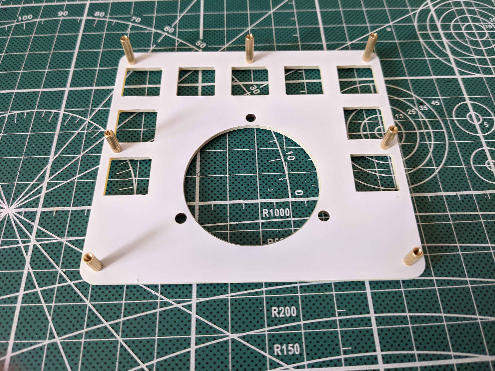
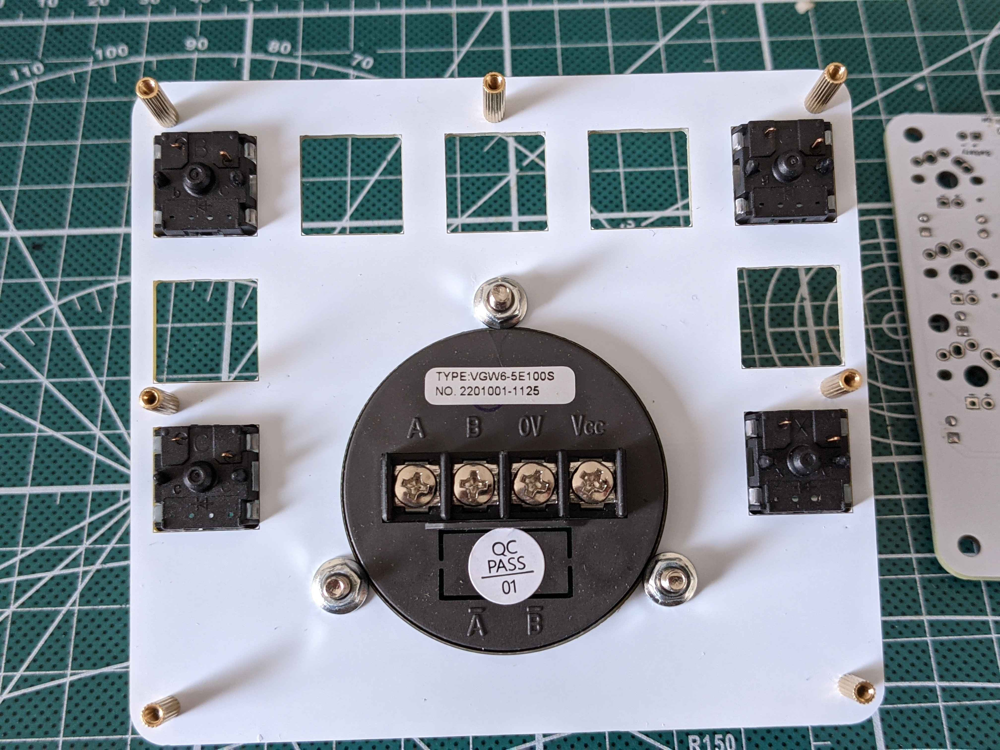

# CNC Encoder Pad Build Instructions
---

## Review your parts and tools

### Electronic Parts List

- [ ] 1 PCB
- [ ] 1 Top Plate
- [ ] 1 Bottom Plate
- [ ] 1 Manual Pulse Generator (Type VGW6-5E100S or ZSS600-001-100B-5E)
- [ ] 1 BlueMicro840 (nice!nano, nrfmicro would also work)
- [ ] 1 LiPo Battery (3030335)
- [ ] 1 foam battery protector
- [ ] 2 12 Pin Low Profile Sockets (millmax...)
- [ ] 1 0.5mm wire for millmax pins (use diode legs)
- [ ] 4 dupont connection wires with female connector at 1 end
- [ ] 1 90 degree 4 pin header
- [ ] 1 surface mount power switch
- [ ] 1 surface mount reset switch
- [ ] 1 KLJ-1102 speaker
- [ ] 9 1N4148 Diodes
- [ ] 9 510 ohm resistors
- [ ] 9 MX mechanical switches
- [ ] 9 keycaps
- [ ] 9 3mm white LEDs
- [ ] 14 4mm m2 screws
- [ ] 3 12mm m2 brass standoffs
- [ ] 2 10mm m2 brass standoffs
- [ ] 2 8mm m2 brass standoffs
- [ ] 4 rubber pads

### Tools needed for building your macropad

- [ ] electronic solder
- [ ] soldering iron
- [ ] desoldering pump and/or desoldering braid
- [ ] multimeter
- [ ] painter's tape
- [ ] pvc tape (electrical tape)
- [ ] thread locker: nail polish or loctite
- [ ] screwdrivers (For m2 screws and encoder terminals)
- [ ] side cutters
- [ ] pliers
- [ ] tweezers

## Prepare PCB and Install Components

### Preparation: Inventory your components and get your tools ready

Review the lists above, compare your components with the following picture.

### Build Step 1: Install the diodes

Diodes can be installed on either sides of the PCB. For future ease of access, install diodes on **bottom side** of the board. Pictures show them instaleld on the top side.

Use a straight edge to bend the diodes prior to installing them on the board.

Black line on the diode lines up with the square pad and thicker line on the PCB silkscreen, bend the legs and push it through.

Bands must match the bands on the silkscreen and the square pads.

After inserting both legs into the PCB, bend the legs outward to keep the diodes in place when soldering.

Top view:

 

Bottom view:

Once all of the diodes are in place they are ready to be soldered. After soldering, clip the legs on the diodes flush with the PCB.  

Diodes soldered.

Top view:

Bottom view:

### Build Step 2: Install the resistors

Resistors can be installed on either sides of the PCB. For future ease of access, install resistors on **bottom side** of the board.  Pictures show them instaleld on the top side.

After inserting both legs into the PCB, bend the legs outward to keep the resistors in place when soldering.

Top view:

 

Bottom view:

Once all of the diodes are in place they are ready to be soldered. After soldering, clip the legs on the diodes flush with the PCB. 

Resistors soldered.

Top view:

Bottom view:

### Step 3:  Install  Sockets 
Install Sockets on the bottom side of the boards. ** DO NOT SOLDER THE BLUEMICRO840 **.

Place the sockets on the boards and use some tape to hold them in place.  

Once in place, solder a single pin and then remove the tape.  While holding the PCB, press down on the socket with your finger and reflow the soldered pin with the iron.  Properly align the socket, remove the iron, and allow the socket to solidify.  Do not place your finger over the pin that is soldered.  It gets hot.

After you are satisfied with the alignment of the sockets, solder the pin on the opposite side of each socket to hold it in place. Solder the remaining pins.

### Build Step 4: 90 degree header

The 4 pin angled header is used to connect the rotary encoder with the controller.  

Because of the limited spacing between the PCB and Bottom Plates, you need to make the header shorter.  You do so by squeezing the black plastic retaining clip to be flush with the angle.  This reduces the total height once installed.

Install and hold the header using tape, then solder.  It's OK  if the header slopes slightly (see pictures).

Once soldered, trim the pinss from  the other side using side-cutters.

### Step 5: Install Reset Switch

Install Reset switch on the **bottom side**. This is a surface mount switch.

Apply some solder to one of the 4 pads. 

Place the switch in position.  Melt the pre-applied solder to "tack" the switch in place. Some recommend to put some solder on the 4 pads.  I find it easier to align the switch if only 1 pad has solder pre-applied. Using tweezers, you can hold the switch and gently touch the leg with the soldering iron and melt the solder. 

Let the solder solidify and solder the other legs.

### Step 6: Install Power Switch

### Step 7: Install Speaker

### Step 8: Install Bluemicro840

BlueMicro840 Orientation - it is important to orient the controller in the correct direction.  NOTE: The PCB has an indication of the **RAW** pin.  Match this pin with the silscreen of the BlueMicro840.

### Steps for completing BlueMicro840 installation using sockets

Tape over the sockets using painter's tape so that the Pro Micro does not get soldered directly to the sockets. Press firmly on the tape in order to see the outline of the sockets.

Use the diode legs that were saved from the previous steps.  Insert a couple of the pins in order to line everything up and then place the BlueMicrroo on top of the sockets. Make sure to face one up and the other down.  Insert pins into the remaining holes.

Note that you need to connect the RAW pin to the VBatt pad.  Simply cut the wire long and bend it over and solder it to form a bridge.

Once the pins are in place, solder the BlueMicro. After soldering, use flush cutters to trim the excess wire.

 Use a small flathead screwdriver to pry the BlueMicro out of the sockets in order to remove the tape.

### Test PCB/BlueMicro840

At this stage, you can test the PCB to make sure it works fine. Mount the BlueMicro and flash a simple firmware to test the switch connections.  Yo won't  be able to test everything but it's easier to flip the diodes now than after you solder all the switches.

## Prepare Top Plate

### Build Step 1: Install Standoffs

Select the top plate.  Inspect carefully both sides of the plate for imperfections (put them inside to hid them).

You can now install the standoffs on the top plate.  The longest ones go at the back and the shorter ones at the front.

## Install Switches

Install the Rotary Encoder with the notch on the front face facing up (away from you). Note that you only need the rotary encoder and top plate. The nuts will be hidden between the top plate and PCB.  You therefore need to complete mechanical installation of the encoder before installing any switches.

 Using some thread locker (I use transparent nail varnish), put some thread locker on the thread before screwing the nut that would squeeze the top plate.  Note that you need to screw them relatively tight so that they dont loosen over time. This is quite important as you won't have access to these nuts once the macropad is assembled. 

 

Install switches at each corner to hold everything in place. Push everything through the PCB and install the remaining switches. Make sure to press down on the PCB to push the PCB and switches together.  Verify that the 2 pins for each switch is coming out below the PCB so that it can be soldered.

Once the corner switches are installed, install the remaining switches and solder them in place.  Solder the four corner switches in while checking for them to remain close to the PCB. Finish with the remaining ones.  

---
## Install LEDs

Note that the longer LED leg is lined-up with the + pin.

Make sure that all the LEDs are installed flush wwith the switches.  Any gaps between the LED and switch may interfere with keycaps.

## Connect Rotary Encoder using Dupont wires

Using the Dupont wires, you can use one end with the connector to the 4-pin header.  The wires will be stripped on the other end to expose the wire and they will be screwed in the block terminal at the back of the rotary encoder.  Note that both the PCB and Encoder have *A B 0V and Vcc* labelled. 

## Install the battery

Solder the batteryy wires as follows:

* Red wire to square pad (+)
* Black wire to round pad (-)
  
Cut a small piece of foam to put the battery on:

Once installed, you should have something that look similar to this:

To make sure that the battery isn't connected in reverse, measure the voltage between RAW and GND on the socket of the BlueMicro.  When the power switch is "ON", you should see somewhere between 3 and 4.2V  (depends on battery level).

Note that I usually install a small foam pad between the battery and the PCB itself.  This cushions the battery against the pins poking holes into the battery (not something good).

## Install BlueMicro
Before installing the bluemicro, you should install plastic tape between the sockets to prevent the metall can of the BlueMicro to touch the switch or LED contacts.

At this point, you can push the BlueMicro back into its socket.

## Verification

The various wires and components should now be installed similarly to the following picture:

You can now flash a firmware to your encoder and test it out.  The default firmware will flash each LED, make some sounds and have a simple keymap to test basic functionality.

## Final assembly 

Line-up evevrything so that the battery doesn't get crushed or protrude on the edges.

Put the bottom plate on and screws the final screws.

Once all assembled, yoou caan install the small rubber pads to pprevent slipping ona desk. 
