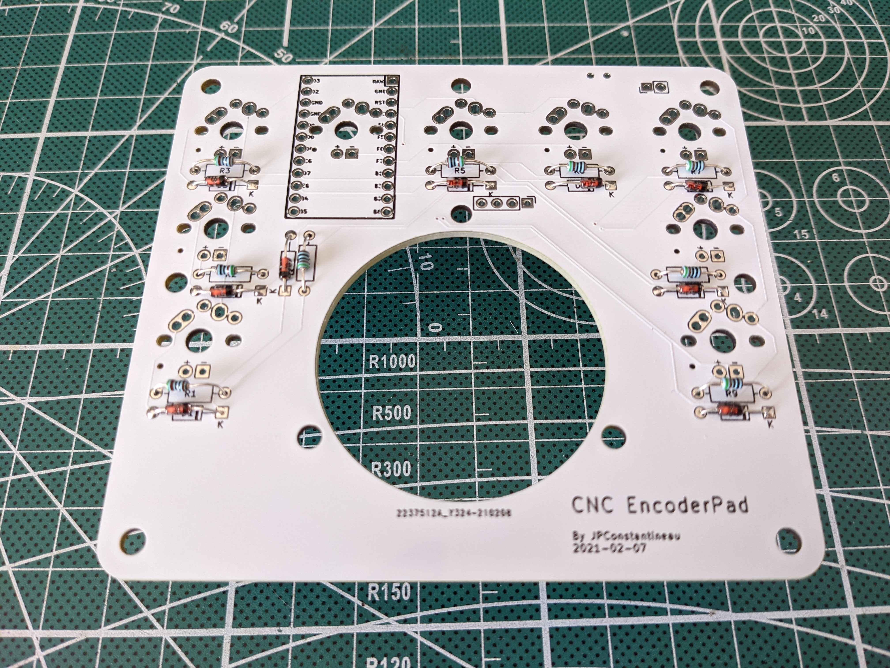
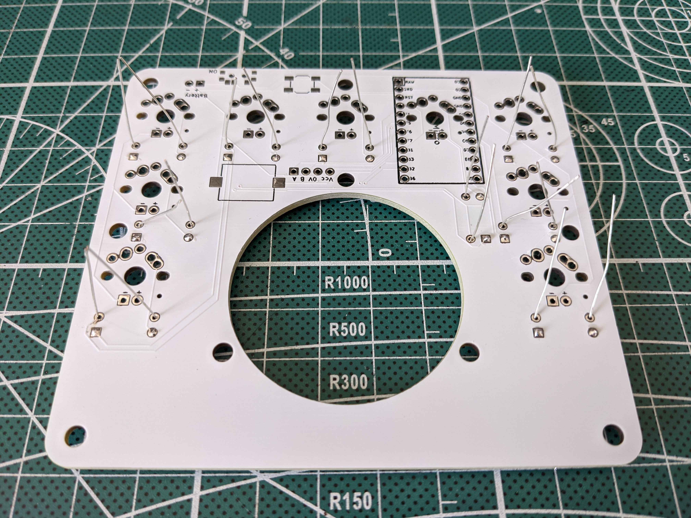

# CNC Encoder Pad Build Instructions
---

## Review your parts and tools

### Electronic Parts List

- [ ] 1 PCB
- [ ] 1 Top Plate
- [ ] 1 Bottom Plate
- [ ] 1 Manual Pulse Generator (Type VGW6-5E100S or ZSS600-001-100B-5E)
- [ ] 1 BlueMicro840 (nice!nano, nrfmicro would also work)
- [ ] 1 LiPo Battery (3030335)
- [ ] 1 foam battery protector
- [ ] 2 12 Pin Low Profile Sockets (millmax...)
- [ ] 1 0.5mm wire for millmax pins (use diode legs)
- [ ] 4 dupont connection wires with female connector at 1 end
- [ ] 1 90 degree 4 pin header
- [ ] 1 surface mount power switch
- [ ] 1 surface mount reset switch
- [ ] 1 KLJ-1102 speaker
- [ ] 9 1N4148 Diodes
- [ ] 9 510 ohm resistors
- [ ] 9 MX mechanical switches
- [ ] 9 keycaps
- [ ] 9 3mm white LEDs
- [ ] 14 4mm m2 screws
- [ ] 3 12mm m2 brass standoffs
- [ ] 2 10mm m2 brass standoffs
- [ ] 2 8mm m2 brass standoffs
- [ ] 4 rubber pads

### Tools needed for building your macropad

- [ ] electronic solder
- [ ] soldering iron
- [ ] desoldering pump and/or desoldering braid
- [ ] multimeter
- [ ] painter's tape
- [ ] pvc tape (electrical tape)
- [ ] thread locker: nail polish or loctite
- [ ] screwdrivers (For m2 screws and encoder terminals)
- [ ] side cutters
- [ ] pliers
- [ ] tweezers

## Prepare PCB and Install Components

### Preparation: Inventory your components and get your tools ready

Review the lists above, compare your components with the following picture.

### Build Step 1: Install the diodes

Diodes can be installed on either sides of the PCB. For future ease of access, install diodes on **bottom side** of the board. Pictures show them instaleld on the top side.

Use a straight edge to bend the diodes prior to installing them on the board.

Black line on the diode lines up with the square pad and thicker line on the PCB silkscreen, bend the legs and push it through.

Bands must match the bands on the silkscreen and the square pads.

After inserting both legs into the PCB, bend the legs outward to keep the diodes in place when soldering.

Top view:

 

Bottom view:

Once all of the diodes are in place they are ready to be soldered. After soldering, clip the legs on the diodes flush with the PCB.  

Diodes soldered.

Top view:

Bottom view:

### Build Step 2: Install the resistors

Resistors can be installed on either sides of the PCB. For future ease of access, install resistors on **bottom side** of the board.  Pictures show them instaleld on the top side.

After inserting both legs into the PCB, bend the legs outward to keep the resistors in place when soldering.

Top view:

 

Bottom view:

Once all of the diodes are in place they are ready to be soldered. After soldering, clip the legs on the diodes flush with the PCB. 

Resistors soldered.

Top view:

Bottom view:

### Step 3:  Install  Sockets 
Install Sockets on the bottom side of the boards. ** DO NOT SOLDER THE BLUEMICRO840 **.

Place the sockets on the boards and use some tape to hold them in place.  

Once in place, solder a single pin and then remove the tape.  While holding the PCB, press down on the socket with your finger and reflow the soldered pin with the iron.  Properly align the socket, remove the iron, and allow the socket to solidify.  Do not place your finger over the pin that is soldered.  It gets hot.

After you are satisfied with the alignment of the sockets, solder the pin on the opposite side of each socket to hold it in place. Solder the remaining pins.

### Build Step 4: 90 degree header

### Step 5: Install Reset Switch

Install Reset switch on the **bottom side**. This is a surface mount switch.

Apply some solder to one of the 4 pads. 

Place the switch in position.  Melt the pre-applied solder to "tack" the switch in place. Some recommend to put some solder on the 4 pads.  I find it easier to align the switch if only 1 pad has solder pre-applied. Using tweezers, you can hold the switch and gently touch the leg with the soldering iron and melt the solder. 

Let the solder solidify and solder the other legs.

### Step 6: Install Power Switch

### Step 7: Install Speaker

### Step 8: Install Bluemicro840

Pro Micro Orientation - it is important to orient the controllers in the correct direction.  The Pro Micro on the left side of the keyboard will have the components facing toward the bottom plate. The Pro Micro on the right side of the keyboard will have the components facing the PCB. NOTE: The PCB has an indication of the **RAW** pin.  Match this pin with the silscreen of the Pro Micro.

In the photo above, the left side of the keyboard is on top and the right side of the keyboard is on the bottom.

### Steps for completing Pro Micro installation using sockets

Tape over the sockets using painter's tape so that the Pro Micro does not get soldered directly to the sockets. Press firmly on the tape in order to see the outline of the sockets.

Use the diode legs that were saved from the previous steps.  Insert a couple of the pins in order to line everything up and then place the Pro Micros on top of the sockets. Make sure to face one up and the other down.  **Do not face the Pro Micros in the same direction** Insert pins into the remaining holes.

Once the pins are in place, solder the Pro Micros. After soldering, use flush cutters to trim the excess wire. Use a small flathead screwdriver to pry the Pro Micros out of the sockets in order to remove the tape.

### Test PCB/BlueMicro840

## Prepare Top Plate

### Build Step 1: Install Standoffs

## Install Switches

Select the top plate for the side you are building.  Inspect carefully both sides of the plate for imperfections (put them inside to hid them) or, in the case of the acrylic plates, for which side is engraved for the stabilizer wire.  

Place the Top plate above the PCB and install switches at each corner to hold everything in place.  Solder the four switches in while pressing down on the PCB to push the PCB and switches together.

Once the corner switches are installed, install the remaining switches and solder them in place.

---
## Test and Flash Pro Micros

It's easier to replace a faulty Pro Micro if it's not already installed.

---
